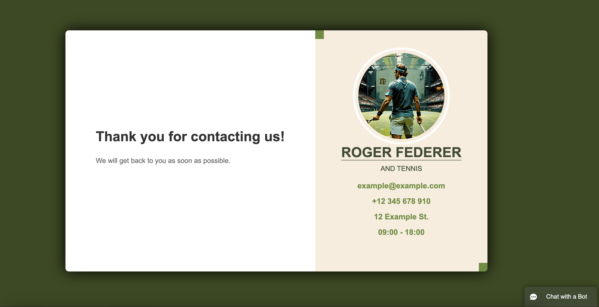

# Aplikacja "Roger Federer & Tenis"

## a. Identyfikacja zagadnienia biznesowego (problemu)

**Cel projektu:**  
Celem projektu było stworzenie platformy skierowanej do fanów tenisa, z naciskiem na osoby zainteresowane karierą Rogera Federera. Aplikacja dostarcza szczegółowych informacji o stylu gry Federera, najważniejszych sezonach jego kariery oraz umożliwia interakcję z trenerami. Platforma umożliwia kontakt za pomocą formularza web-to-lead zintegrowanego z Salesforce, a także rezerwację kortu poprzez wbudowany kalendarz. Dodatkowo, w celu usprawnienia komunikacji, zintegrowano chatbota Einstein Bot z Salesforce.

**Zakres projektu:**  
Aplikacja spełnia potrzeby biznesowe poprzez zintegrowanie narzędzi ułatwiających kontakt z trenerami i interakcję użytkowników. Brakuje jednak funkcji rejestracji, logowania oraz panelu administracyjnego, które mogłyby ułatwić zarządzanie użytkownikami i trenerami.

## b. Wymagania systemowe i funkcjonalne

**Wymagania systemowe:**  
- Przeglądarka internetowa (np. Chrome, Firefox, Safari)
- Node.js do uruchomienia aplikacji React
- Salesforce (do obsługi formularza kontaktowego i chatbota)
- Narzędzia integracyjne Salesforce (formularz web-to-lead, Einstein Bot)
- Połączenie internetowe

**Wymagania funkcjonalne:**  
- **Frontend**: Aplikacja zbudowana w React, z dynamicznymi funkcjami, takimi jak kalendarz rezerwacji lekcji i chatbot Einstein Bot.
- **Integracja z Salesforce**: Formularz kontaktowy web-to-lead, przesyłający zapytania użytkowników bezpośrednio do Salesforce CRM. Einstein Bot odpowiada na pytania użytkowników w czasie rzeczywistym.
- **Kalendarz rezerwacji**: Interaktywny kalendarz umożliwiający rezerwację lekcji z trenerami.
- **Chatbot**: Einstein Bot, wbudowany w aplikację, zapisujący  do serwisu potencjalnego klienta (uzytkownika) lub przekierowujący rozmowę do Service Consol.

**Model architektury:**  
Aplikacja zbudowana w modelu **klient-serwer**. Frontend React umożliwia interakcję z użytkownikami, natomiast zewnętrzne narzędzia Salesforce obsługują formularze kontaktowe i chatbota.

## c. Analiza zagadnienia i jego modelowanie

### Modele obiektowe

- **Diagram klas** (uproszczony):  
  - **Klasa Użytkownik**: Przedstawia użytkownika aplikacji (np. osoby rezerwujące lekcje).
    - Pola: imię, email, numer telefonu.
    - Metody: złożenie zapytania, rezerwacja lekcji.
  - **Klasa Lekcja**: Przechowuje informacje o zaplanowanej lekcji tenisowej.
    - Pola: czas, użytkownik.
    - Metody: zaplanowanie lekcji.

### Diagram ERD (Entity Relationship Diagram) – dla przyszłej bazy danych:
- **Użytkownik** (id, imię, nazwisko, email, telefon)
  - Relacja: 1:N z encją **Rezerwacja Lekcji**
- **Trener** (id, imię, specjalizacja, dostępność)
  - Relacja: 1:N z encją **Rezerwacja Lekcji**
- **Rezerwacja Lekcji** (id, data, godzina, id_użytkownika)

### Procesy
- **Rezerwacja lekcji**: Użytkownik wybiera dostępny termin w kalendarzu, podaje swoje dane i rezerwuje lekcję.
- **Kontakt z trenerem**: Formularz web-to-lead wysyła zapytanie użytkownika bezpośrednio do Salesforce, gdzie zapytania są zarządzane.

## d. Implementacja

**Technologie:**
- **Frontend**: React, HTML5, CSS3
- **Integracja Salesforce**: Web-to-lead do przesyłania zapytań, Einstein Bot do obsługi pytań w czasie rzeczywistym.
- **Zewnętrzne biblioteki**: react-calendar (kalendarz rezerwacji lekcji).

### Kluczowe fragmenty kodu:

1. **Formularz kontaktowy zintegrowany z Salesforce**:

   ```jsx
   const handleSubmit = (e) => {
     e.preventDefault();
     const formData = new FormData(e.target);
     fetch("https://webto.salesforce.com/servlet/servlet.WebToLead?encoding=UTF-8", {
       method: "POST",
       body: formData
     })
     .then(response => alert("Zapytanie wysłane"))
     .catch(error => alert("Wystąpił błąd"));
   };

   return (
     <form onSubmit={handleSubmit}>
       <input type="text" name="first_name" placeholder="Imię" required />
       <input type="email" name="email" placeholder="Email" required />
       <button type="submit">Wyślij</button>
     </form>
   );
 
 2. **Kalendarz rezerwacji lekcji**;
    ```jsx
    import Calendar from 'react-calendar';
    const BookingCalendar = () => {
    const [date, setDate] = useState(new Date());

    const handleDateChange = (newDate) => {
        setDate(newDate);
    };

    return (
        <div>
        <h2>Zarezerwuj lekcję</h2>
        <Calendar onChange={handleDateChange} value={date} />
        <p>Wybrany termin: {date.toDateString()}</p>
        </div>
    );
    };

    export default BookingCalendar;

3. **Einstein Bot (Chatbot Salesforce): Einstein Bot jest konfigurowany po stronie Salesforce i osadzany w aplikacji za pomocą dostarczonego kodu skryptu.**
    ```jsx
    <script src="https://unpkg.com/@salesforce/embedded-service-chat"></script>
    <script>
    embedded_svc.settings.displayHelpButton = true;
    embedded_svc.settings.language = 'pl';
    embedded_svc.settings.enabledFeatures = ['LiveAgent'];
    embedded_svc.settings.entryFeature = 'LiveAgent';
    embedded_svc.init('https://yourInstance.salesforce.com', 'https://yourService.salesforce.com', 'your-org-id');
    </script>

### Narzędzia:

React – główny framework do budowy aplikacji.
Salesforce – do obsługi formularzy kontaktowych oraz chatbota Einstein Bot.
react-calendar – do wyświetlania dostępnych terminów rezerwacji.

## e. Podsumowanie

### Osiągnięty cel:
Aplikacja spełnia podstawowe założenia projektu, takie jak dostarczenie informacji o karierze Rogera Federera, umożliwienie rezerwacji lekcji tenisowych oraz interakcji z użytkownikami za pomocą formularza kontaktowego i chatbota Einstein Bot. Dzięki integracji z Salesforce możliwa jest obsługa leadów oraz szybka komunikacja z użytkownikami za pomocą chatbota.

### Napotkane trudności:
Projekt napotkał trudności związane z brakiem zaawansowanego systemu autoryzacji i logowania, co ogranicza personalizację doświadczenia użytkownika.

### Perspektywy rozwoju:
W przyszłości planuje się dodanie funkcji rejestracji i logowania, co pozwoli użytkownikom na dostęp do historii ich rezerwacji oraz spersonalizowaną komunikację. Dodatkowo, planowana jest rozbudowa panelu administracyjnego, który umożliwi zarządzanie dostępnością trenerów i lekcji.
